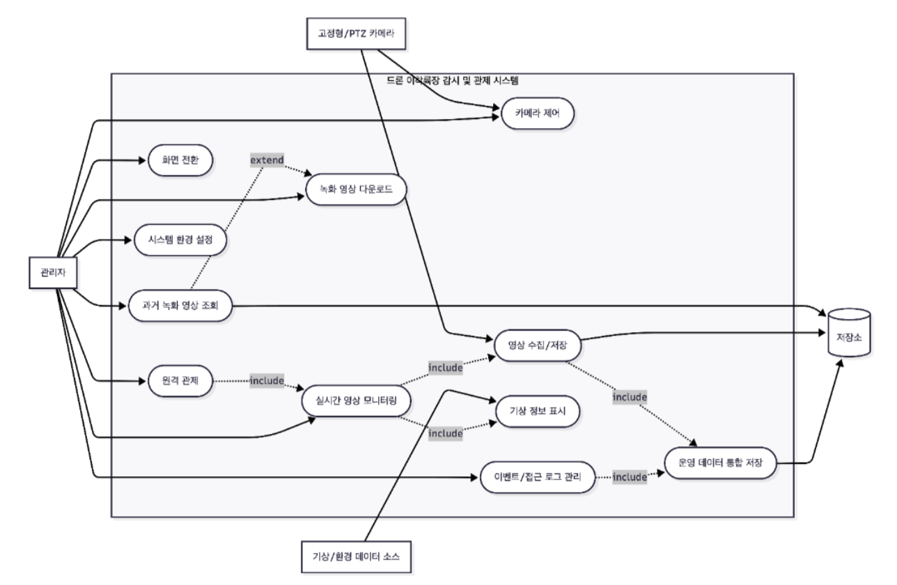
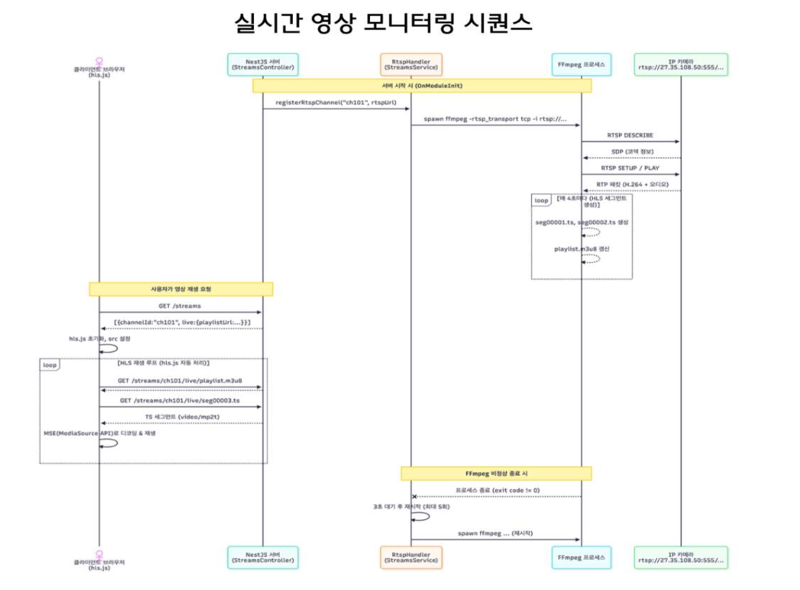
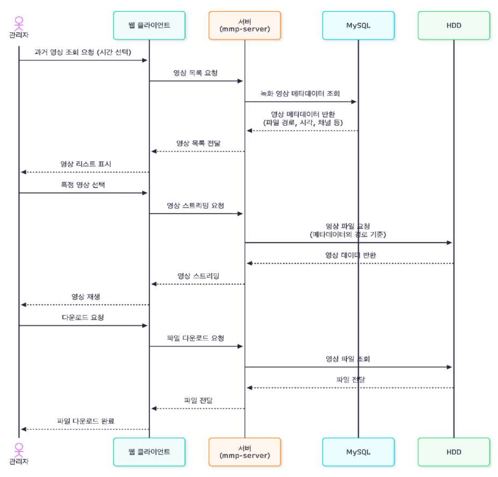

# 📋 Meeting Minutes

## 🧭 회의 정보

- **회의 제목**: 드론 이착륙장 감시 시스템 프로젝트 회의
- **일시**: 2026년 3월 31일
- **장소**: 융복합관
- **참석자**: 이견희, 서형철, 이준섭, 유지훈, 이상민
- **작성자**: 유지훈

---

## 📌 안건

- 논문 언제꺼 할지?
- 발표 자료 만들기
- 시퀀스 다이어그램 설계
- 유즈케이스 설계
- 시스템 구조도 수정사항 반영
- hw선정

---

## 🗒️ 회의 내용

### 유즈케이스 다이어그램

### 시퀀스 다이어그램

**실시간 영상 모니터링 시퀀스**

**과거 영상 조회 및 재생 시퀀스**

### 역할 분담 및 협업 체계

| 역할 | 담당자 |
|------|--------|
| 프론트엔드 | 이준섭, 이상민 |
| 백엔드 | 유지훈, 이견희 |
| 인프라 및 논문 | 서형철 |
